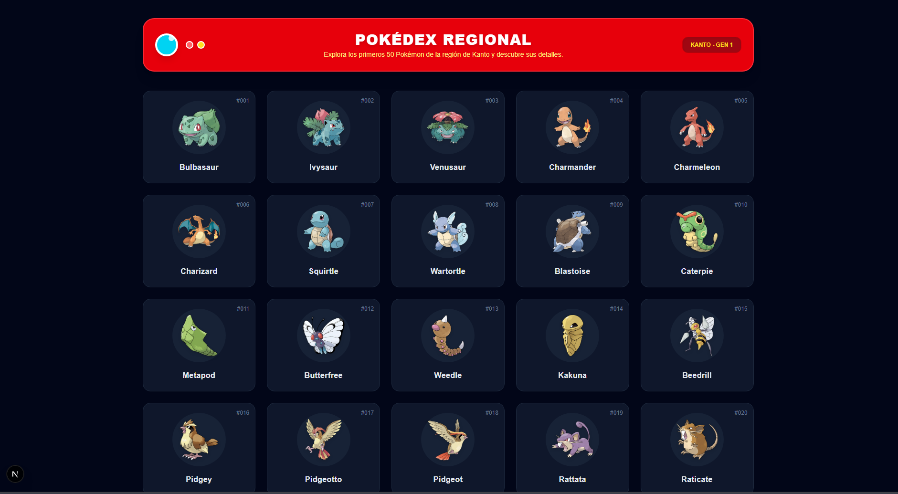
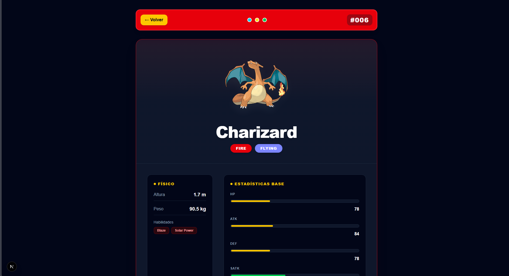

# 🕹️ Pokédex 8-Bit — Optimización de Transferencia de Datos

Pokédex construida con **Next.js (App Router)**, **TypeScript** y **TanStack Query (React Query) v5**, pensada como ejercicio práctico de rendimiento web: precarga de datos, manejo de caché y sincronización servidor-cliente mediante hidratación, todo consumiendo la **PokéAPI**. La interfaz retoma la estética de las consolas de 8 bits (tipografía pixelada, bordes recortados en escalón y paneles tipo pantalla retro) como homenaje a los juegos clásicos de Pokémon.

---

## Stack

- **Next.js 16+** (App Router y React Server Components)
- **TanStack Query v5** (`@tanstack/react-query`)
- **TypeScript** en modo estricto
- **Tailwind CSS** para el sistema visual retro
- **PokéAPI** (`https://pokeapi.co/api/v2`) como fuente de datos

---

## Qué hace la app

1. **Listado inicial (servidor y cliente):** muestra una cuadrícula con los primeros 50 Pokémon de Kanto, cada tarjeta con su número de Pokédex y su artwork oficial.
2. **Precarga al pasar el cursor:** al poner el mouse sobre una tarjeta se dispara `queryClient.prefetchQuery`, así los datos del detalle (tipos, stats, habilidades) ya están listos en caché antes de hacer clic.
3. **Hidratación entre servidor y cliente:** las rutas dinámicas usan `<HydrationBoundary>` junto con `dehydrate` para pasarle al navegador el estado que ya se resolvió en el servidor, sin volver a pedirlo.
4. **Carga anticipada de imágenes:** los primeros sprites se precargan y se marcan como `priority` para que la primera vista se sienta instantánea.

---

## Cómo está configurada la caché

La configuración vive en `app/providers.tsx` y responde a los objetivos de rendimiento de la actividad:

- **`staleTime` de 24 horas:** lo que llega de la PokéAPI (listas y detalles) se trata como "fresco" durante un día completo, así que moverse entre el listado y los detalles no genera peticiones repetidas.
- **`gcTime` de 48 horas:** los datos que ya no se están usando se mantienen en memoria el doble de tiempo que el `staleTime`, para que sigan disponibles sin recargar si el usuario vuelve a pasar por ahí.
- **`refetchOnWindowFocus` desactivado:** evita que la app vuelva a pedir datos solo por cambiar de pestaña, cuidando el ancho de banda y manteniendo estable la caché local.

---

## Puesta en marcha

1. Entra a la carpeta del proyecto:

   ```bash
   cd pokemon-app
   ```

2. Levanta el servidor de desarrollo:

   ```bash
   npm run dev
   ```

## Capturas




---

## Autor

**Kevin Alexander Ortez Oliva**
Proyecto realizado para la tarea *Optimización de Transferencia de Datos con TanStack Query*.
